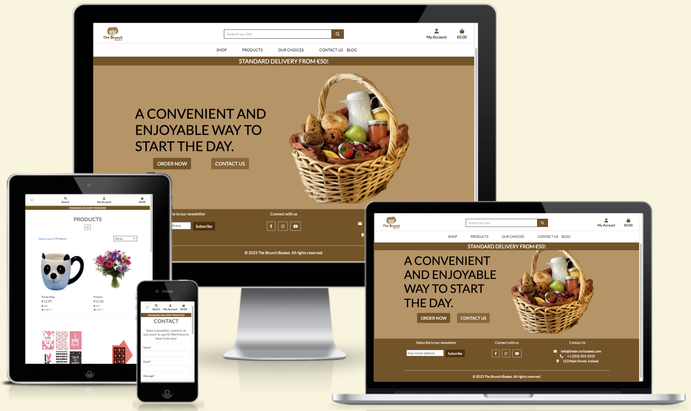
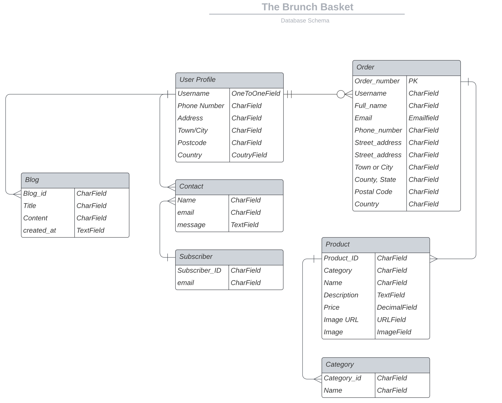
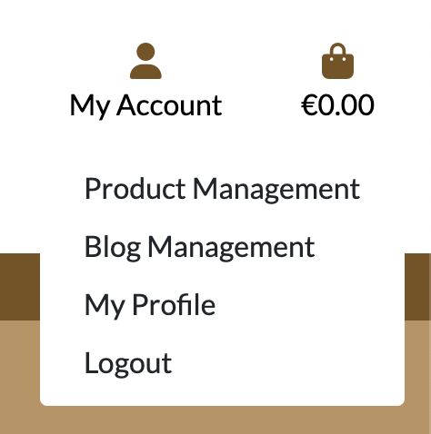
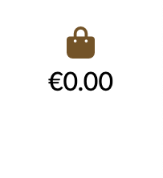
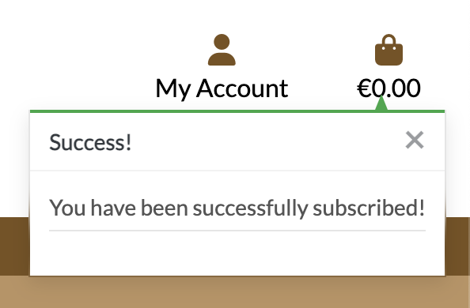
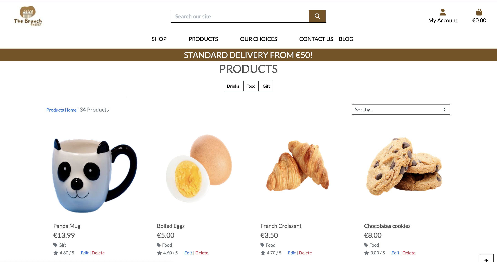
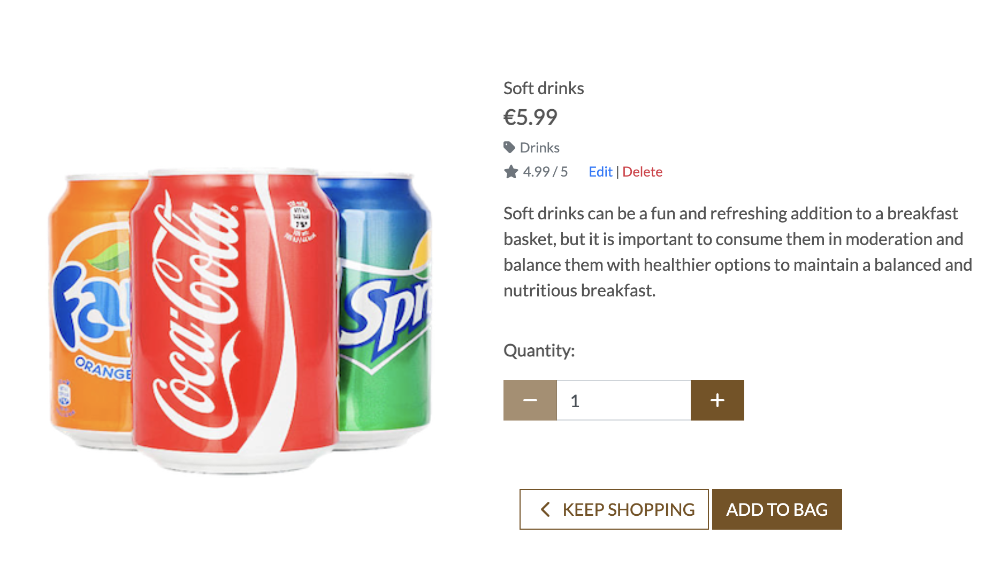
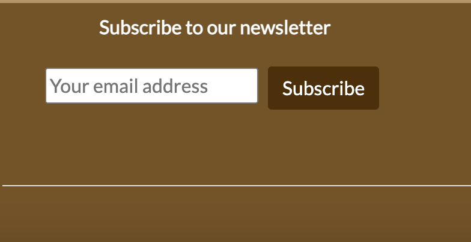
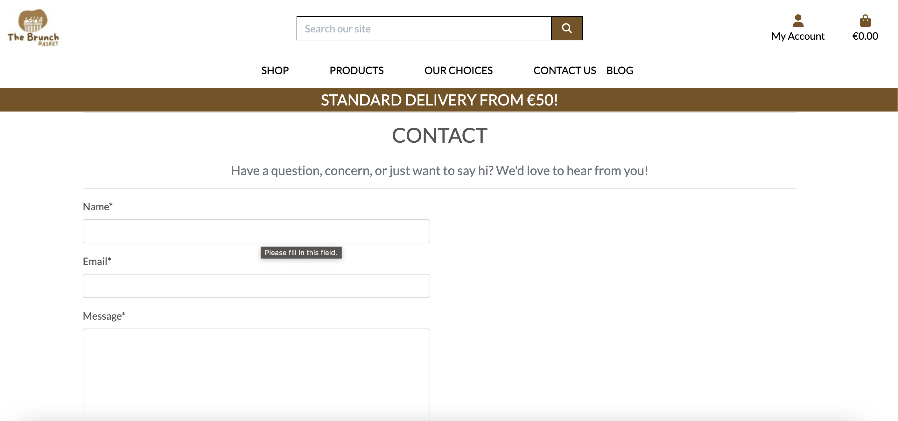
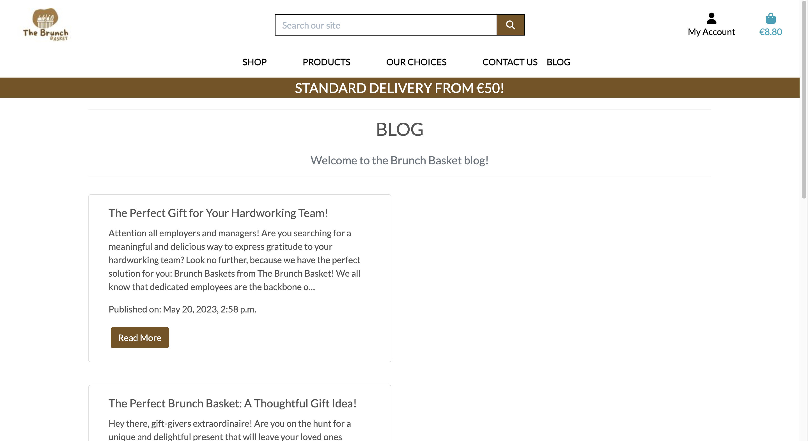

<h1 align="center">The Brunch Basket</h1>

The Brunch Basket is a premier online marketplace for brunch lovers who want to elevate their dining experience. We offer a carefully curated selection of high-quality brunch items, including gourmet brunch baskets, artisanal bread, pastries, and spreads, as well as premium coffee and tea. Our mission is to provide customers with a convenient and hassle-free way to enjoy a delicious brunch in the comfort of their own home or workplace.

\
&nbsp;
Live link can be found here - [The Brunch Basket](https://the-brunch-basket.herokuapp.com/ "The Brunch Basket")

\
&nbsp;

# Table of Contents
* [User Experience](#user-experience "User Experience")
    * [Target Audience](#target-audience "Target Audience")
    * [User Goals](#user-goals "User Goals")
    * [User Stories](#user-stories "User Stories")
    * [Wireframes](#wireframes "Wireframes")
    * [Databases](#database "Databases")
    * [Design Choices](#design-choices "Design Choices")
    * [Marketing Strategies](#marketing-strategies "Marketing Strategies")
    * [Features to be Implemented](#fetures-to-be-implemented "Features-to-be-implemented")
    * [Technologies used](#technologies-used "Technologies used")
    * [Testing](#testing "Testing")
    * [Deployment](#deployment "Deployment")
    * [Acknowledgments](#acknowledgments "Acknowledgments")

# About Us
The Brunch Basket is a premier online marketplace for brunch lovers who want to elevate their dining experience. We offer a carefully curated selection of high-quality brunch items, including gourmet brunch baskets, artisanal bread, pastries, and spreads, as well as premium coffee and tea. Our mission is to provide customers with a convenient and hassle-free way to enjoy a delicious brunch in the comfort of their own home or workplace. 

# User Experience
The Brunch Basket e-commerce aplication mission is provide customers with a convenient and user-friendly platform to purchase products or services online. 

## Target Audience
### Demographics:

Age: 25-44 years old
Gender: All genders
Location: Urban and suburban areas
Income: €40,000-€100,000

### Psychographics:

* Brunch enthusiasts who enjoy trying new brunch spots, hosting brunch gatherings, and experimenting with different brunch recipes.
* Busy professionals who value convenience and efficiency in the online shopping experience, and are looking for high-quality brunch-related products that they can purchase online.
* Gift buyers who are looking for unique and thoughtful gifts for friends and family who love brunch.
* Sustainability and ethical consumers who value eco-friendly and ethical products, and are looking for sustainably sourced and ethically produced brunch-related products.

## User Goals

1. Browse and select the products
2. Quickly create orders and securely purchase
3. Find information about the company
4. Login and out functionality
5. Contact customer support
6. Subscribe to receive regular updates

## User Stories
| ID | As a | wants to be able to... | so that... |
|--|--|--|--|
| 01 | Store Owner | create, Update, and Delete products | keep the products updated on the site
| 02 | Store Owner | manage and track customer subscriptions | provide them with the best possible service
| 03 | Store Owner | manage the FAQ page | Remove them from the store
| 04 | Store Owner | easily manage customer profiles | keep track of their preferences and purchase history
| 05 | Store Owner | easily manage subscribers and send out newsletters | keep customers informed about new products and promotions.
| 06 | Shopper | update my contact information | don't miss out on important updates or promotions.
| 07 | Shopper | view the site's FAQ page | view the site's FAQ page
| 08 | Site User | easily browse the brunch basket options | choose the one that best fits my needs
| 09 | Site User | easily view all the available products options, including pictures and detailed descriptions | make an informed decision about my purchase.
| 10 | Site User | add products to my cart and checkout quickly and easily | get on with my day
| 11 | Site User | contact customer support with any questions or concerns | feel confident in my purchase.
| 12 | Site User | receive notifications when I complete their orders | make sure there is nothing wrong.
| 13 | Site User | subscribe to an email list | stay up to date on new product offerings and promotions
| 14 | Site User | easily adjust the quantity of items in my cart or remove items entirely | change my mind about my purchase.
| 15 | Site User | easily find answers to common questions about the brunch baskets and the ordering process | quickly resolve any issues I might encounter.
| 16 | Site User | FAQ page to be comprehensive and easy to navigate | don't waste time searching for the information I need
| 17 | Site User | easily add products to my shopping bag and see the total cost | keep track of my order as I shop.
| 19 | Site User | contact the site owner if I have any questions or concerns about my order | receive prompt and helpful assistance.
| 20 | Site User | view the site's FAQ page | find answers to common questions about the site and its products.
| 21 | Site User | view all available products and filter them by price, rating, and category | I can easily find the right product for me.
| 22 | Site User | create and manage my own account profile | view my order history and update my personal information and preferences.
| 23 | Site User | subscribe | stay up-to-date on new products and promotions.

## Wireframes
The Entity-Relationship Diagram below shows how the database models relate to each other:

## Designer Choices
#### **Color Scheme**
The color palette for The Brunch Basket website was carefully selected to create a cohesive and harmonious design.

#### **Fonts**

[Lato](https://fonts.google.com/specimen/Lato?query=lato#about) - Lato is a sans serif typeface family it gives the website a soft generic feel.

### **Logo**
I created a basic Favicon for this project using [Canva](https://www.canva.com/). 

# Marketing Strategies

The marketing strategies for The Brunch Basket encompass a multi-channel approach, utilizing various digital platforms to reach and engage with the target audience. This includes leveraging email marketing, maintaining an informative blog, and harnessing the power of social media platforms such as Facebook, Instagram, and YouTube. Each of these channels plays a significant role in building brand awareness, fostering customer engagement, and driving business growth. By incorporating visually appealing content, user-generated interactions, and collaborations with influencers.

[Facebook](https://www.facebook.com/profile.php?id=100092292570505) 

# Features

## Homepage

### Logo 

### Search Bar 

### My Account 

### Shopping Bag 

### Message Success

### Product Navigation

### Product Details

### Call-To-Action

### Subscriber

### Contact

### Blog

### Footer

# Features to be Implemented
The following features can enhance the user experience, increase customer engagement, and improve overall satisfaction. 

- A wishlist feature allows users to save items they are interested in for future reference, making it easier to track and consider purchasing them later.
- Product reviews empower customers to share their opinions and experiences, aiding other potential buyers in making informed decisions
- Frequently Asked Questions (FAQ) sections offer a convenient way for users to find quick answers to common queries, reducing the need for direct customer support.
- Coupons provide users with discounts and promotional offers, encouraging sales and fostering customer loyalty. 

# Technologies used
## Languages
* [HTML](https://en.wikipedia.org/wiki/HTML5) 
* [CSS](https://en.wikipedia.org/wiki/CSS)
* [JavaScript](https://en.wikipedia.org/wiki/JavaScript)
* [jQuery](https://jquery.com/)
* [Python](https://en.wikipedia.org/wiki/Python_)
* [Markdown](https://en.wikipedia.org/wiki/Markdown)
 
## Libraries, Frameworks and Tools
* [django](https://en.wikipedia.org/wiki/Django_)
* [gunicorn](https://en.wikipedia.org/wiki/Gunicorn)
* [psycopg2](https://wiki.postgresql.org/wiki/Psycopg)
* [cloudinary](https://cloudinary.com/)
* [auth](https://docs.djangoproject.com/en/3.2/topics/auth/)
* [django-mathfilters](https://pypi.org/project/django-mathfilters/)
* [crispy-forms](https://django-crispy-forms.readthedocs.io/en/latest/)
* [xml-sitemaps](https://www.xml-sitemaps.com/)
* [w3.org](https://validator.w3.org/)
* [w3.org](https://jigsaw.w3.org/css-validator/)
* [jshint](https://jshint.com/)
* [PEP8](http://pep8online.com/)
* [Lucid](https://lucid.co/)
* [Istock](https://www.istockphoto.com/)
* [Gitpod](https://www.gitpod.io/)
* [Balsamic](https://balsamiq.com/wireframes/)
* [Bootstrap](https://getbootstrap.com)
* [Font Awesome library](https://fontawesome.com/)
* [Secret Key Generator](https://miniwebtool.com/django-secret-key-generator/)
* [coolors](https://coolors.co/)
* [Google Fonts](https://fonts.google.com/)
* [WebAIM](https://webaim.org/resources/contrastchecker/)
* [Pillow](https://pillow.readthedocs.io/en/stable/)
* [Stripe](https://stripe.com/en-gb)
* [favicon.io](https://favicon.io/)

# Testing

## Manual Testing
### **Admin**

### **Superuser / Admin**

**Adding a Product**
1. As a Site Owner, I want to be able to add a product so that I can add more items to my store. I performed the following manual tests:

- Verified that products can be added through the project management page under 'My Account' and the Admin Panel.
- Ensured that all required fields were validated correctly, displaying explicit error messages for each field.
- Verified that all required fields were marked with an asterisk.
- Checked that number fields only accepted numeric input.
- Tested the functionality of image uploading, including the use of a placeholder image and correct storage of uploaded images in the designated Amazon Web Services Bucket and Folder.
- Validated that the buttons (Cancel and Add product) worked as expected, redirecting the user to the appropriate pages.
- Confirmed the display of an alert message in the top right corner upon successful product addition.

**Editing/Updating a Product**
2. As a Site Owner, I want to be able to edit/update a product to change its price, description, and other criteria. I conducted the following manual tests:

- Tested the availability of the Edit button on product cards, ensuring it was accessible only to Superusers.
- Verified that clicking the Edit button took the user to a product form pre-populated with the current information of the product being edited.
- Ensured proper validation of fields, including number fields and required fields, displaying error messages for incorrect input.
- Checked the behavior when removing an image, confirming that a placeholder image replaced it upon saving.
- Tested the replacement of an existing image with a new one, ensuring it was stored correctly in the Amazon Web Services Bucket and Folder.
- Verified the appearance of an alert message displaying the product being edited, matching the populated product name in the edit form.
- Ensured that buttons (Cancel and Update product) worked as expected, redirecting the user to the appropriate pages.
- Confirmed that the updated product information was saved and reflected accurately in the admin panel and on the Product Details page.

**Deleting a Product**
3. As a Site Owner, I want to be able to delete a product to remove items that are no longer available. I performed the following manual tests:

- Clicked the delete button on a product card to navigate to the Delete Confirmation Page.
- Confirmed that the product was removed from the product model and no longer available on the Products Page.
- Checked that accessing the product URL of a deleted product led to a 404 error page, indicating it was no longer accessible.
- Verified the display of a success message confirming the successful deletion of the product.

**Email Notifications**
4. As a Site Owner, I want to be able to send emails to customers with a subscription, notifying them of deals, sales, and new arrivals. I conducted the following manual tests:

- Subscribed with an email address and verified that it was added to the business's Mailchimp contacts list.
- Tested the unsubscribe functionality by unsubscribing the email address and verifying its removal from the Mailchimp email list.
- Checked that unsubscribed users could re-subscribe by submitting their email address again, resulting in their addition back to the subscribed email list.
- Ensured that error messages were displayed for incorrect email inputs and success messages confirmed successful subscriptions.

**Blog**
5. As a Site Owner, I want to have a blog section on my website to provide valuable content to my audience. I conducted the following manual tests:

- Verified that the blog section is accessible and displayed prominently on the website.
- Tested the functionality to view individual blog posts by clicking on their titles or read more buttons.
- Ensured that blog posts are displayed with the correct formatting, including headings, paragraphs, images, and any other relevant media.
- Checked that the publication date information are correctly displayed.
- Verified that comments can be added to blog posts, if applicable, and that they are displayed correctly.
- Tested the sharing functionality to ensure that blog posts can be easily shared on various social media platforms.
- Ensured that the blog section is responsive and displays properly on different devices and screen sizes.

**Contact**
6. As a Site Owner, I want to provide a contact page so that users can easily reach out to me. I performed the following manual tests:

- Accessed the contact page and verified that it contains the necessary contact information such as email, phone number, and physical address, if applicable.
- Checked that a contact form is available for users to fill out and submit their inquiries.
- Tested the validation of the contact form, ensuring that required fields are marked and appropriate error messages are displayed for missing or incorrect information.
- Submitted the contact form with valid information and verified that it was successfully sent.
- Checked for any confirmation messages or notifications upon successful submission of the contact form.
- Ensured that an email notification is received by the site owner or relevant team members upon form submission.
- Verified that the contact page is responsive and displays correctly on different devices and screen sizes.

**Subscriptions**
7. As a Site Owner, I want to allow users to subscribe to receive updates and newsletters. I conducted the following manual tests:

- Checked the availability of a subscription feature, such as a subscription form or newsletter signup section, on the website.
- Filled out the subscription form with a valid email address and submitted it.
- Verified that the form had proper validation, displaying error messages for invalid email addresses or any other required fields.
- Confirmed that a success message or notification appeared upon successful subscription, thanking the user for subscribing.
- Checked the backend system or email marketing service to ensure that the subscriber's email address was added to the appropriate mailing list or database.
- Tested the functionality of unsubscribing from the subscription, either by clicking an unsubscribe link in the received emails or by using an unsubscribe option on the website.
- Ensured that the unsubscribed email address was removed from the mailing list or database and that any further emails were not sent to that address.
- Verified that the subscription feature is responsive and functions correctly on different devices and screen sizes.

### **Shopper**

**Shopping Cart**
1. As a Shopper, I want to be able to add products to my cart, review my cart contents, and proceed to checkout. I performed the following manual tests:

- Added products to the cart from the product listing page and verified that the cart updated with the correct quantity and total price.
- Checked that the cart displayed the product name, quantity, unit price, and subtotal for each item.
- Verified that the cart correctly calculated the total price of all items, including any applicable taxes or discounts.
- Tested the functionality to remove items from the cart and ensured that the cart updated accordingly.
- Proceeded to checkout and confirmed that the cart contents were correctly transferred to the checkout page.
- Verified that the checkout page displayed the correct products, quantities, prices, and total amount.
- Tested the different checkout steps, such as entering shipping and billing information, selecting payment methods, and confirming the order.
- Ensured that the order confirmation page displayed the order details, including the products, quantities, prices, and total amount.
- Checked that the inventory was properly updated after completing the checkout process.

**Blog Reading**
2. As a Shopper, I want to be able to read blog posts to gain valuable information and insights. I conducted the following manual tests:

- Navigated to the blog section and ensured that the list of blog posts was displayed.
- Clicked on a blog post title or read more button to access the full blog post.
- Verified that the blog post was displayed with the correct formatting, including headings, paragraphs, images, and other relevant media.
- Checked for the presence of publication date, and any associated tags or categories.

**Subscription**
3. As a Shopper, I want to have the option to subscribe to receive updates, newsletters, or special offers. I performed the following manual tests:

- Located the subscription feature, such as a subscription form or newsletter signup section, on the website.
- Entered a valid email address in the subscription form and submitted it.
- Verified that the form had proper validation, displaying error messages for invalid email addresses or any other required fields.
- Confirmed that a success message or notification appeared upon successful subscription, thanking the user for subscribing.
- Checked the backend system or email marketing service to ensure that the subscriber's email address was added to the appropriate mailing list or database.
- Verified that the subscription feature was responsive and functioned correctly on different devices and screen sizes.

**Contact**
4. As a Shopper, I want to be able to contact the site owner or customer support for inquiries or assistance. I performed the following manual tests:

- Accessed the contact page and verified that it contained the necessary contact information, such as email, and any additional details.
- Tested the functionality of the contact form, entering the required information and submitting the form.
- Ensured that the form had proper validation, displaying error messages for missing or incorrect information.
- Confirmed that a success message or notification appeared upon successful submission of the contact form.
- Checked for any notifications received by the site owner or relevant team members

**Search Products**
5. As a Shopper, I want to be able to search for specific products easily. I performed the following manual tests:

- Located the search bar on the website, typically found in the header or a prominent location.
- Entered various search terms, including product names, keywords, or specific attributes.
- Verified that the search results page displayed relevant products based on the search query.
- Checked that the search results included the product name, image, price, and any other relevant information.
- Tested the pagination or infinite scrolling functionality to navigate through multiple pages of search results, if applicable.
- Tried refining the search using filters or sorting options and ensured that the search results updated accordingly.
- Clicked on a product from the search results and confirmed that it redirected to the correct product details page.
- Ensured that the search functionality was case-insensitive and could handle partial or misspelled search terms.
- Tested the search feature on different devices and screen sizes to ensure it was responsive and displayed properly.

**Product Details**
6. As a Shopper, I want to view detailed information about a product before making a purchase. I performed the following manual tests:

- Clicked on a product from the product listing or search results to access the product details page.
- Verified that the product details page displayed the correct product name, description, price, and any other relevant information.
- Checked for the presence of product images or a product image gallery, allowing shoppers to view multiple images of the product.
- Tested the zoom or enlarge functionality on product images, if available, to examine product details more closely.
- Verified that the product details page included information about product availability, shipping options, and estimated delivery times.
- Checked for any additional product details, such as product dimensions, materials, specifications, or customer reviews.
- Tested the functionality to select product variations or options, such as size, color, or quantity, and ensured that the price and availability updated accordingly.
- Added the product to the shopping cart from the product details page and verified that it was successfully added.
- Tested any related or recommended product sections on the product details page to ensure they displayed relevant products.
- Ensured that the product details page was responsive and displayed properly on different devices and screen sizes.

**Functionality**
7. As a Shopper, I expect the website to have certain functionalities that enhance my browsing and shopping experience. I performed the following manual tests to ensure the overall site functionality:

- Checked the website navigation, including the menu structure and links to different pages, to ensure they are intuitive and easily accessible.
- Verified that the website logo is clickable and redirects to the homepage.
- Tested the responsiveness of the website across various devices and screen sizes to ensure proper display and functionality.
- Checked for the presence of a "Home" or "Back to Top" button, allowing users to quickly navigate to the top of the page.
- Tested the functionality of social media links or buttons, ensuring they open the correct social media profiles/pages.
- Checked for the presence of a search bar, allowing users to search for specific products or content easily.
- Verified that the website URLs are user-friendly, descriptive, and follow a consistent structure.
- Tested the functionality of pagination or infinite scrolling on pages with multiple items, ensuring smooth navigation and loading of additional content.
- Verified that links to external websites or resources open in new tabs or windows, preserving the user's browsing session.
- Tested the website's loading speed and performance, ensuring that pages and images load quickly.
- Verified that any forms on the website, such as contact forms or checkout forms, have proper validation and display clear error messages for any issues.
Checked for the presence of a footer with relevant links, such as terms and conditions, privacy policy, and customer support information.

# Validator Testing

- The HTML templates were validated using [W3 Validator](https://validator.w3.org/nu/#textarea). No major errors were returned for the HTML segments.
- The CSS style sheet was validated using [W3C Validator](https://jigsaw.w3.org/css-validator/#validate_by_input) and no errors were returned.
- The JavaScript files were run through [JSHint](https://jshint.com/) and no errors were found apart from a few missing semi-colons which were added. Also, the project was run through whilst checking for any issues in the console. No errors were found.
- The code was validated using [PEP8](http://pep8online.com/). No errors were returned.
- The finished project was also run through [Wave](https://wave.webaim.org/) to check for issues with contrast styling and HTML structure. 

# Responsive Testing

I also tested this project's responsiveness across multiple devices including:

- iPhone X
- iPhone 8
- Samsung S21 FE
- Samsung S10+
- Samsung Galaxy Z Flip3
- iPad Pro 9.7"
- MacBook Pro 13"

I also used Google developer tools to check responsiveness across multiple other devices and screen sizes. 

# Deployment 

This project was re-deployed on [Render](https://render.com/) following steps provided by Code Institute, as Heroku's free plan was discontinued. The below steps are to deploy onto Heroku not Render. 

This project was deployed using Heroku. At the time of deployment, Heroku was facing a security issue, therefore this project was deployed via the command line in GitPod and those are the steps detailed below. As this was the case I was unable to allow automatic deployments in Heroku each time a commit was pushed into the repository.

See the following steps to deploy below:

1. Log into Heroku and Create a New App.

2. Give the App a name, it must be unique, and select a region closest to you. 

3. Click on 'Create App'. This will take you to a page where you can deploy your project. 

4. Next, click on the 'Resources' tab and search for 'Heroku Postgres' in the Add-ons section to add the Heroku Postgres database to the project. 

5. Click on the 'Settings' tab at the top of the page. The following steps must be completed before deployment.

6. Within the settings.py file you need to import os and import dj_database_url at the top. Then, in the command line install dj_database_url and psycopg2 so that we can use Postgres. Freeze these installs into the requirements.txt file.

7. Scroll down to Config Vars (also known as Environment Variables) and click 'Reveal Config Vars'. Here the database URL is stored to run my app on Heroku. 

I used an if statement in settings.py (see below) so that when our app is running in Heroku, we connect to Postgres but in our local environment, we connect to sequel light:

    development = os.environ.get('DEVELOPMENT', False)

    if development:

            DATABASES = {
                'default': {
                    'ENGINE': 'django.db.backends.sqlite3',
                    'NAME': BASE_DIR / 'db.sqlite3',
                }
            }

        else:

            DATABASES = {
                'default': dj_database_url.parse(os.environ.get('DATABASE_URL'))
            }

Development is set in gitpod's environment variables as True.

8. Next I ran the migrations again to set up my Postgres Database by running **Python 3 manage.py migrate** within the command line and then create a Superuser using **python3 manage.py create superuser**.

9. Following setting up the database I generated a new Secret Key, to replace the insecure key that was in settings.py and added: **os.environ.get('SECRET_KEY')**. I then added the newly generated key to the Config Vars on Heroku. 

10. We must then install Gunicorn, which will act as our webserver and freeze that into our requirements file.

11. Next, I created a Procfile to tell Heroku to create a web dyno that will run Gunicorn and serve our Django app.

Within this file add the following:

    web: gunicorn the_brunch_basket.wsgi

Web tells Heroku to allow web traffic, whilst Gunicorn is the server installed earlier, a web services gateway interface server (wsgi). This is a standard that allows Python services to integrate with web servers.

12. I then told Heroku temporarily disable collectstatic by using the Heroku config set, disable collectstatic = 1. I added this via Heroku's Config Vars but this can also be added via the command line. This was to prevent Heroku from attempting to deploy the static files, causing an error, until Amazon Web Services was set up. 

13. Then add the hostname of our Heroku app to 'Allowed Hosts' in settings.py as well as localhost so that GitPod will still work too.

14. I then committed and pushed these changes into my GitHub repository so that I could start my first deployment. Once complete, log into Heroku using the following command in the terminal, **heroku login -i**,  and enter your login details.

15. Once logged in, add a remote to your local repository with the Heroku git:remote command and your Heroku app’s name: **heroku git:remote -a the-brunch-basket**

16. Finally, deploy using the following command: **git push heroku main**. Once deployed you can open the app from the command line to ensure it was successfully deployed.

17. Once we can confirm the app deployed successfully, we need to set up Amazon Web Services as this will be where my media and static files are stored. To do this I first created an account with Amazon Web Services. Then, I searched for the service, S3, using the search bar at the top of the page. 

18. Click into it and then click the orange 'Create a Bucket' button. I named this bucked to match my cthe-brunch-basket Heroku app name to keep things simple. Then, I selected my region and changed the 'Object Ownership' setting to **ACLs enabled**. Then, I unchecked block all public access, acknowledged that the bucket will be public, and clicked on the 'Create Bucket' button.

19. Next, on the properties tab, I scrolled to the bottom and turned on static website hosting.
This gave me a new endpoint that I can use to access it from the internet. For the index and error document, I filled in some default values and then clicked Save.

20. Now on the permissions tab I pasted in the following coors configuration:

    [
        
        {
            "AllowedHeaders": [
            "Authorization"
            ],

            "AllowedMethods": [
            "GET"
            ],

            "AllowedOrigins": [
            "*"
            ],

            "ExposeHeaders": []
        }
        
    ]

which is going to set up the required access between our Heroku app and this s3 bucket.

21. Next I'll go to the bucket policy tab a select, policy generator so we can create a security policy for this bucket. The policy type is going to be s3 bucket policy and then allow all principals by using a '*' and the action will be, get object. Next, I copied the ARN which stands for Amazon resource Name from the other tab and paste it into the ARN box at the bottom. I then clicked 'Add statement' and then 'Generate Policy'.

22. I then copied this policy into the bucket policy editor. I then added '/*' at the end of the resource key to allow access to all resources in this bucket and then saved it.

23. Finally, to complete configuration, I went to the 'access control list' tab and checked edit and enable List for Everyone (public access), and accepted the warning box.

24. Next I created a group and a user to access the bucket by searching for the service IAM (Identify and Access Management). I clicked on 'User Groups' and then 'Create User Group' giving it the name 'manage-the-brunch-basket'. 

25. I then created the Policy used to access our bucket by clicking 'Policies' and then 'Create Policy'. I clicked onto the JSON tab and then selected import managed policy to import one that AWS has pre-built for full access to s3.

26. I searched for s3 and then import the s3 full access policy. I then got the bucket ARN from the bucket policy page in s3 and pasted that into the 'Resource' section on the JSON tab.

I then clicked the 'Next' buttons until I reached 'Review Policy'. I gave it a name and a description and then clicked 'Create Policy'. This took me back to the policies page.

27. Next I attached the policy to the Group I created by returning to the Create User Group page and refreshing the Policies box. I then was able to attach the new policy created by selecting it and finally clicking 'Create Group'.

28. Finally I created a user to put in the group by going to the User's page and clicking 'Add User'. I created a user named **the-brunch-basket-static-files-user**, gave them Programmatic Access, and clicked 'Create User'. 

29. I then downloaded the CSV file which contained this User's Access Key and Secret Access Key which I used to authenticate them from my Django app. It is important to download this file as you cannot be re-downloaded and contains the new user's credentials which I next add to the Config Vars on Heroku.

30. Next, I connected Django to the new S3 bucket. To do this I installed two new packages:
- boto3
- django-storages 

31. I then pip3 freeze these to the requirements.txt file to ensure they're installed on the next Heroku Deploy and added **storages** to our installed apps in settings.py. 

32. To connect Django to S3 (only on Heroku) I then added the following in if statement settings.py:

        if 'USE_AWS' in os.environ:
            # Bucket Config
            AWS_STORAGE_BUCKET_NAME = 'the-brunch-basket'
            AWS_S3_REGION_NAME = 'eu-west-2'
            AWS_ACCESS_KEY_ID = os.environ.get('AWS_ACCESS_KEY_ID')
            AWS_SECRET_ACCESS_KEY = os.environ.get('AWS_SECRET_ACCESS_KEY')
            AWS_S3_CUSTOM_DOMAIN = f'{AWS_STORAGE_BUCKET_NAME}.s3.amazonaws.com'

            # Static and media files
            STATICFILES_STORAGE = 'custom_storages.StaticStorage'
            STATICFILES_LOCATION = 'static'
            DEFAULT_FILE_STORAGE = 'custom_storages.MediaStorage'
            MEDIAFILES_LOCATION = 'media'

            # Override static and media URLs in production
            STATIC_URL = f'https://{AWS_S3_CUSTOM_DOMAIN}/{STATICFILES_LOCATION}/'
            MEDIA_URL = f'https://{AWS_S3_CUSTOM_DOMAIN}/{MEDIAFILES_LOCATION}/'

33. I then added the following to our Config Vars on Heroku:
- USE_AWS = True
- AWS_ACCESS_KEY_ID, taken from the new user credentials
- AWS_SECRET_ACCESS_KEY, taken from the new user credentials

and removed:
- Remove staticcollect=1 from congifvars within Heroku 

I also set DEBUG to 'DEVELOPMENT' in os.environ as for security it cannot be set to True on the deployed version. 

34. The next step is to tell Django that in production we want to use s3 to store our static files whenever someone runs collectstatic and that we want any uploaded product images to go there also. To do that I created a file called custom_storages.py.

35. Within this file I imported both our settings from django.conf and the s3boto3 storage class from Django Storages. Then I created custom classes for static storage and media storage which inherited the imported class from Django Storages to give it all its functionality. Then I set the class to store static and media files in the location specified in the USE_AWS if statement within settings.py.

36. Finally, to complete the deployment of the AWS setup, I committed the changes and pushed them to GitHub. In the command line I then typed the following command: **git push heroku main**. If you need to login to Heroku again complete steps 14 - 16 to re-deploy. Once Heroku is allowing users to connect to their GitHub accounts you can set up automatic deploys which will remove the need to repeat these steps.

# Acknowledgments
Thank you to all who encouraged and supported me as I created my first full-stack E-Commerce website. Thank you to the Tutors at Code Institute for always helping to figure out issues I encountered that I was unable to solve myself.