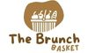

# The Brunch Basket

The Brunch Basket is a premier online marketplace for brunch lovers who want to elevate their dining experience. We offer a carefully curated selection of high-quality brunch items, including gourmet brunch baskets, artisanal bread, pastries, and spreads, as well as premium coffee and tea. Our mission is to provide customers with a convenient and hassle-free way to enjoy a delicious brunch in the comfort of their own home or workplace.

\
&nbsp;
Live link can be found here - [The Brunch Basket](https://the-brunch-basket.herokuapp.com/ "The Brunch Basket")

\
&nbsp;

# Table of Contents
* [About Us](#about-us "About Us")
* [Mission Statement](#mission-statement "Mission Statement")
* [Target Audience](#target-audience "Target Audience")
    * [User Goals](#user-goals "User Goals")
    * [User Stories](#user-stories "User Stories")
    * [Wireframes](#wireframes "Wireframes")
    * [Design Choices](#design-choices "Design Choices")
        * Fonts
            * Content
            * Headings
        * Colours
        * Images
    * [Structure](#structure "Structure")
        * Site Structure
        * Data Schema
        * Models
        * Forms
    * [Branches](#branches "Branches")
    * [Features](#features "Features")
        * Existing Features
        * Features to be implemented
    * [Technologies used](#technologies-used "Technologies used")
        * Languages
        * Libraries, Frameworks and Tools
    * [Testing](#testing "Testing")
        * UX Testing
        * Manual Testing
        * Code Validation
        * Bugs
        * Unfixed Bugs
    * [Deployment](#deployment "Deployment")
        * Local Deployment
        * Deployment via Heroku
    * [Credits](#credits "Credits")
    * [My Thoughts](#my-thoughts "My Thoughts")

# About Us
The Brunch Basket is a premier online marketplace for brunch lovers who want to elevate their dining experience. We offer a carefully curated selection of high-quality brunch items, including gourmet brunch baskets, artisanal bread, pastries, and spreads, as well as premium coffee and tea. Our mission is to provide customers with a convenient and hassle-free way to enjoy a delicious brunch in the comfort of their own home or workplace. 

# Mission Statement
The Brunch Basket e-commerce aplication mission is provide customers with a convenient and user-friendly platform to purchase products or services online. 

# Target Audience
### Demographics:

Age: 25-44 years old
Gender: All genders
Location: Urban and suburban areas
Income: €40,000-€100,000

### Psychographics:

* Brunch enthusiasts who enjoy trying new brunch spots, hosting brunch gatherings, and experimenting with different brunch recipes.
* Busy professionals who value convenience and efficiency in the online shopping experience, and are looking for high-quality brunch-related products that they can purchase online.
* Gift buyers who are looking for unique and thoughtful gifts for friends and family who love brunch.
* Sustainability and ethical consumers who value eco-friendly and ethical products, and are looking for sustainably sourced and ethically produced brunch-related products.

## User Goals

1. Browse and select the products
2. Quickly create orders and securely purchase
3. Find information about the company
4. Login and out functionality
5. Contact customer support
6. Subscribe to receive regular updates

## User Stories
| ID | As a | wants to be able to... | so that... |
|--|--|--|--|
| 01 | Store Owner | create, Update, and Delete products | keep the products updated on the site
| 02 | Store Owner | manage and track customer subscriptions | provide them with the best possible service
| 03 | Store Owner | manage the FAQ page | Remove them from the store
| 04 | Store Owner | easily manage customer profiles | keep track of their preferences and purchase history
| 05 | Store Owner | easily manage subscribers and send out newsletters | keep customers informed about new products and promotions.
| 06 | Shopper | update my contact information | don't miss out on important updates or promotions.
| 07 | Shopper | view the site's FAQ page | view the site's FAQ page
| 08 | Site User | easily browse the brunch basket options | choose the one that best fits my needs
| 09 | Site User | easily view all the available products options, including pictures and detailed descriptions | make an informed decision about my purchase.
| 10 | Site User | add products to my cart and checkout quickly and easily | get on with my day
| 11 | Site User | contact customer support with any questions or concerns | feel confident in my purchase.
| 12 | Site User | receive notifications when I complete their orders | make sure there is nothing wrong.
| 13 | Site User | subscribe to an email list | stay up to date on new product offerings and promotions
| 14 | Site User | easily adjust the quantity of items in my cart or remove items entirely | change my mind about my purchase.
| 15 | Site User | easily find answers to common questions about the brunch baskets and the ordering process | quickly resolve any issues I might encounter.
| 16 | Site User | FAQ page to be comprehensive and easy to navigate | don't waste time searching for the information I need
| 17 | Site User | easily add products to my shopping bag and see the total cost | keep track of my order as I shop.
| 19 | Site User | contact the site owner if I have any questions or concerns about my order | receive prompt and helpful assistance.
| 20 | Site User | view the site's FAQ page | find answers to common questions about the site and its products.
| 21 | Site User | view all available products and filter them by price, rating, and category | I can easily find the right product for me.
| 22 | Site User | create and manage my own account profile | view my order history and update my personal information and preferences.
| 23 | Site User | subscribe | stay up-to-date on new products and promotions.

#### **Color Scheme**
Choosing the right color palette for your breakfast basket ecommerce website can play a significant role in creating a visually appealing and memorable user experience. Here are some color palette ideas that you may want to consider:

Soft and muted: Opt for a softer and more subdued color palette using shades of pastel colors like light brown and bege. This palette can give your website a cozy, welcoming feel.

#### **Fonts**

[Lato](https://fonts.google.com/specimen/Lato?query=lato#about) - Lato is a sans serif typeface family it gives the website a soft generic feel.

# Technologies used

## Languages

HTML [HTML](https://en.wikipedia.org/wiki/HTML5 "HTML") 
CSS[CSS](https://en.wikipedia.org/wiki/CSS "CSS")
JavaScript[JavaScript](https://en.wikipedia.org/wiki/JavaScript "JS")
jQuery[jQuery](https://jquery.com/ "jQuery")
Python[Python](https://en.wikipedia.org/wiki/Python_(programming_language) "Python")
Markdown[Markdown](https://en.wikipedia.org/wiki/Markdown)
 
## Libraries, Frameworks and Tools
Django [django](https://en.wikipedia.org/wiki/Django_(web_framework) "django")|
gunicorn[gunicorn](https://en.wikipedia.org/wiki/Gunicorn "gunicorn")|
psycopg2[psycopg2](https://wiki.postgresql.org/wiki/Psycopg "psycogg2")
cloudinary[cloudinary](https://cloudinary.com/ "cloudinary")|
django auth[auth](https://docs.djangoproject.com/en/3.2/topics/auth/ "auth")|
django mathfilters [django-mathfilters](https://pypi.org/project/django-mathfilters/)
django crispy forms[crispy-forms](https://django-crispy-forms.readthedocs.io/en/latest/ "crispy-forms")
Sitemap Generator[xml-sitemaps](https://www.xml-sitemaps.com/ "XML-Sitemaps.com")
|HTML Validation[w3.org](https://validator.w3.org/ "W3C")
CSS Validation[w3.org](https://jigsaw.w3.org/css-validator/ "W3C")
JS Validation[jshint](https://jshint.com/ "JSHint")
PEP8[PEP8](http://pep8online.com/ "PEP8")
Lucid[Lucid](https://lucid.co/ "Lucid")
Istock[Istock](https://www.istockphoto.com/ "iStock")
GitPod[Gitpod](https://www.gitpod.io/ "Gitpod")
Balsamic[Balsamic](https://balsamiq.com/wireframes/ "Balsamic")
Bootstrap[Bootstrap](https://getbootstrap.com "Bootstrap")
Font Awesome[Font Awesome library](https://fontawesome.com/ "Font Awesome")
miniwebtool[Secret Key Generator](https://miniwebtool.com/django-secret-key-generator/ "miniwebtool")
Colours[coolors](https://coolors.co/ "coolors")|
Google Fonts[Google Fonts](https://fonts.google.com/ "Fonts")|
WebAIM [WebAIM](https://webaim.org/resources/contrastchecker/ "WebAIM")|
Pillow [Pillow](https://pillow.readthedocs.io/en/stable/ "Pillow")
Stripe[Stripe](https://stripe.com/en-gb "Stripe")
favicon.io[favicon.io](https://favicon.io/ "favicon.io")

# Testing

\
&nbsp;

### UX Testing
