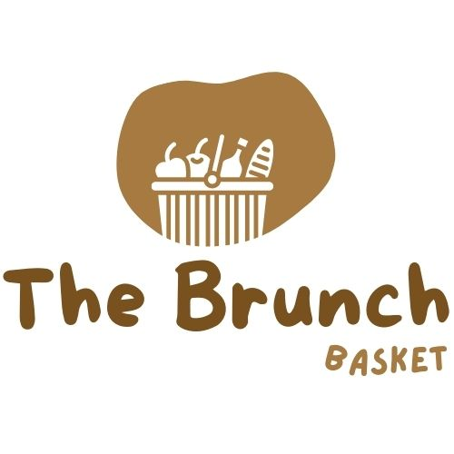

# The Brunch Basket

The Brunch Basket is a premier online marketplace for brunch lovers who want to elevate their dining experience. We offer a carefully curated selection of high-quality brunch items, including gourmet brunch baskets, artisanal bread, pastries, and spreads, as well as premium coffee and tea. Our mission is to provide customers with a convenient and hassle-free way to enjoy a delicious brunch in the comfort of their own home or workplace.

## [Live site]()

## [Contents](#contents)

[UX](#ux)

- [User stories](#user-stories)

- [Design](#design)

- [Wireframes](#wireframes)

[Database Model](#database-model)

[Features](#features)

- [Existing Features](#existing-features)

- [Features Left to Implement](#features-left-to-implement)

[Technoloies Used](#technologies-used)

[Deployment](#deployment)

[Testing](#testing)

[Credits](#credits)

## **UX**

### **User stories**

### **Design**

#### **Color Scheme**
Choosing the right color palette for your breakfast basket ecommerce website can play a significant role in creating a visually appealing and memorable user experience. Here are some color palette ideas that you may want to consider:

Soft and muted: Opt for a softer and more subdued color palette using shades of pastel colors like light brown and bege. This palette can give your website a cozy, welcoming feel.

#### **Fonts**

[Lato](https://fonts.google.com/specimen/Lato?query=lato#about) - Lato is a sans serif typeface family it gives the website a soft generic feel.